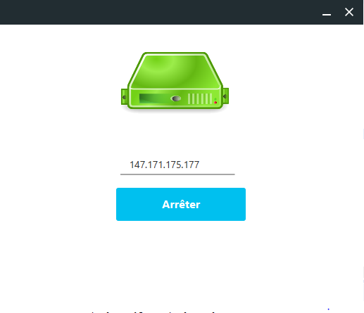

 INTRODUCTION :

Dans le cadre d’une évaluation dans le module «Projet» , Notre professeur nous a demandé de réaliser un projet pour améliorer notre acquis en Programmation orienté objet “Java ”  , c’est une approche qui propose de réaliser un  framework  d’un réseau social et une application témoin avec un haut niveau d’abstraction .

Planning de projet et organisation de groupe
	 	 
       1.1  . Méthode scrum :
	
On  a choisi de travailler avec la méthode SCRUM , le processus agile qui permet de produire la plus grande valeur métier dans la durée la plus courte, le Scrum veut avant tout produire un logiciel fonctionnel. 

       1.2  . Rôle de chacun :

 Le chef de projet de notre groupe «Loïc» est chargé du management de projet , il a comme rôle de distribuer les tâches de chaque personne ainsi de gérer les heures faite pour des différents tâches.

 Un groupe de développement « Dan, Dian et Yi » qui font des parties de développement comme les taches (connexion / inscription / publication … )

 Un développeur réseau «Mohamed» qui s’occupe de la partie RMI / communication client & serveur et UI.

 Les documentalistes «Loubna & Abel» qui sont en charge de rédiger le rapport et les comptes rendu ainsi d'autres tâches de gestion ou de développement.

     1.3  . Les fonctionnalités  : 
Les fonctionnalités  de notre projet destinées par notre groupe, Il est créé à partir des exigences, les éléments les plus importants figurent en tête du backlog de produit. 

ID
Fonctionnalité
1 - Inscription ( client / serveur )
2 - Inscription des différents utilisateurs et du super administrateur
3 - Publication ( client / serveur )
4 - Réaction à une publication
5 - Mettre du contenu dans la publication
6 - Commentaire à une publication

